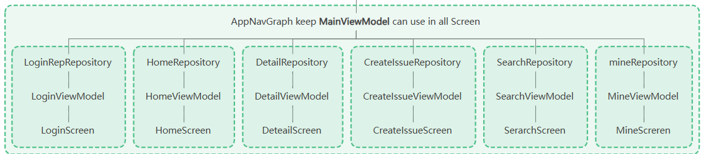
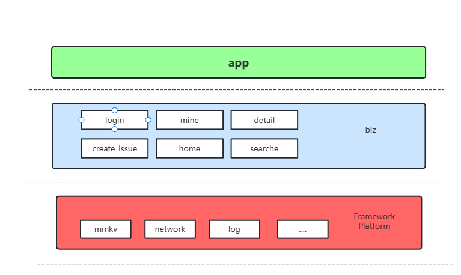
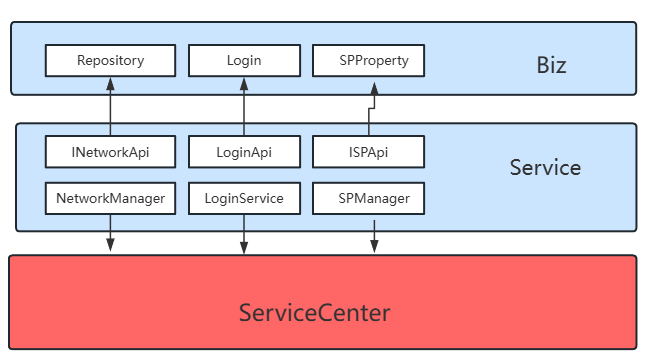

# GitHub Demo Application

## Project Description

This project mainly uses Compose UI Navigation to implement the interface development. The main idea
is to use componentization and MMKV. In order to simplify the logic and ensure module decoupling,
some abstractions have been made.

### Business Implementation

The business implementation can be divided into Repository, UI, and ViewModel:

1. **BaseRepository**:
   Provides [getService](app/src/main/java/com/wings/githubwings/framework/network/base/BaseRepository.kt)
   to create:
    - GithubServiceApi
    - AuthServiceApi
    - All extended classes can make network requests directly through BaseRepository

2. **NavigationViewModel**: Encapsulates common CommonUIState and BaseScreen. BaseScreen can
   directly use CommonUIState status to display loading, success, and failure.

3. **Network Request**: Encapsulated NetworkResult, which can use Result to simplify some code
   writing.

4. **AppNavGraph**: Page navigation that holds the external activity's MainViewModel, so page jumps
   can obtain MainViewModel to monitor login status and network changes.
   

## Project Structure

The project engineering file structure is mainly divided into three
parts: [app (application shell project)](app), [biz (main business files, which store modules of different main businesses, and subsequent businesses can be split into other modules)](app/src/main/java/com/wings/githubwings/biz), [framework (basic engineering module)](app/src/main/java/com/wings/githubwings/framework)

### Framework

The framework basic module mainly contains platform-level basic support modules, such
as [mmkv](app/src/main/java/com/wings/githubwings/framework/mmkv), [network](app/src/main/java/com/wings/githubwings/framework/network),
etc.

### Biz

Main business files that store modules of different main businesses. Subsequent businesses can be
split into other modules, such
as [login](app/src/main/java/com/wings/githubwings/biz/login), [mine](app/src/main/java/com/wings/githubwings/biz/mine),
etc.

### Application Layering

## Main Ideas

The main ideas of this project are componentization and MMKV.

### Componentization

Componentization mainly separates implementation and interfaces. When users develop different pages,
they can only see the interfaces. Therefore, ServiceCenter is defined in the basic module to cache
long-life-cycle Services in the project. Through interfaces as keys, Services are put together,
providing possibilities for future plug-and-play functionality implementation.

### Features

      Search for GitHub repositories by keyword.
      View detailed information about a repository.
      Create issues for a repository.
      Login to GitHub using OAuth.
      View user profile information.
      Browse user repositories.